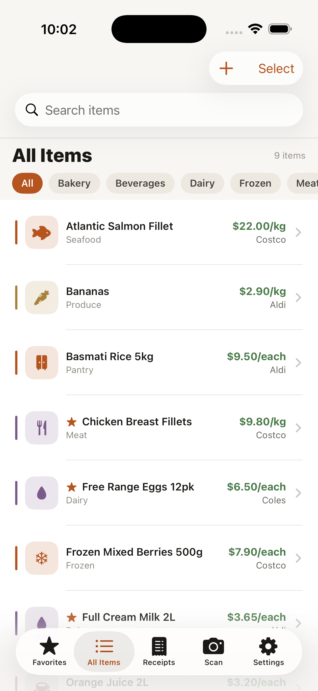
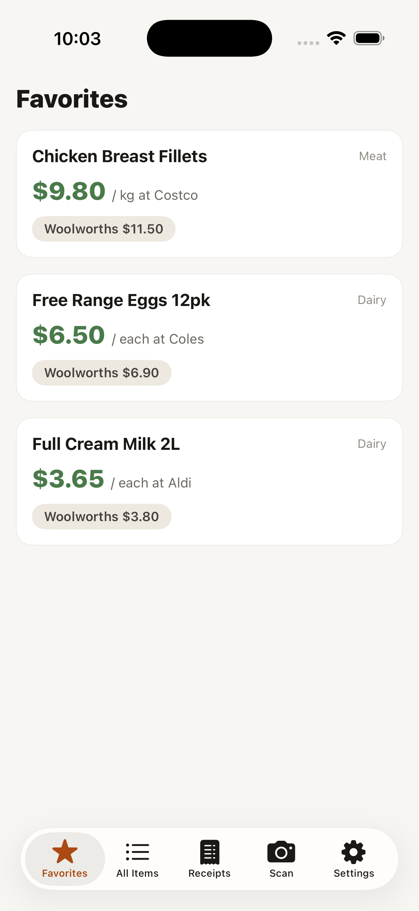
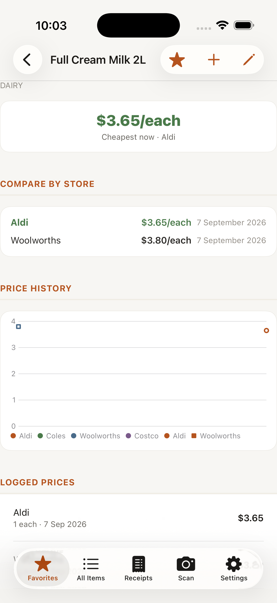

# PriceTrack

Scan grocery receipts, itemise them, and see which store (Aldi, Coles, Woolworths, Costco) is actually cheapest per item — by unit price, not just sticker price. Favourite the items you care about (A2 milk, eggs, etc.) to keep them front and centre.

<p>
  
  
  
</p>

*(Screenshots use fictional sample data, not real receipts.)*

## One-time setup

1. **Install Xcode** from the Mac App Store (needed to build/run — this machine currently only has the Command Line Tools).
2. **Install XcodeGen**:
   ```bash
   brew install xcodegen
   ```
3. **Generate the Xcode project** (run from this `PriceTrack/` folder):
   ```bash
   xcodegen generate
   ```
   This creates `PriceTrack.xcodeproj` from `project.yml`. Re-run this any time files are added/removed from `project.yml`'s source paths — you don't need to re-run it for edits to existing files.

   Note: `PriceTrack/App/Info.plist` is **generated** by this step from the `info.properties` block in `project.yml` — it gets overwritten every time you run `xcodegen generate`. Edit it in `project.yml`, not in the plist file directly.
4. **Open `PriceTrack.xcodeproj` in Xcode** and set your signing team: select the `PriceTrack` target → *Signing & Capabilities* → pick your Apple ID team under *Team*.
5. Build and run on a Simulator or your device (⌘R).

### About iCloud sync

The app currently runs **fully local** (no iCloud/CloudKit sync) — `useCloudKit = false` in `PriceTrackApp.swift`, and there's no iCloud entitlement in `project.yml`. This isn't optional right now: a free Apple ID ("Personal Team") **cannot provision the iCloud capability at all**, even just for running on your own device — Xcode will refuse to sign the app if the entitlement is present. You'd hit "Personal development teams... do not support the iCloud capability" the moment you tried to run on a real iPhone.

Once you're enrolled in the paid Apple Developer Program ($99/year), to turn sync back on:
1. In `project.yml`, add back an `entitlements:` block on the `PriceTrack` target with `com.apple.developer.icloud-container-identifiers` (`iCloud.com.akshay.pricetrack`), `com.apple.developer.icloud-services` (`CloudKit`), and `com.apple.developer.ubiquity-kvstore-identifier` (`$(TeamIdentifierPrefix)$(CFBundleIdentifier)`).
2. Run `xcodegen generate` again.
3. In `PriceTrack/App/PriceTrackApp.swift`, set `useCloudKit = true`.

## How it works

- **Scan tab** — capture a receipt with the camera (or pick an existing photo), on-device Vision OCR reads the text, and you tap each line to assign it to an item, price, quantity, and unit. This is deliberately "OCR + confirm" rather than fully automatic, since receipt layouts vary a lot between stores and blind parsing gets it wrong often enough to be annoying.
- **Favourites tab** — your starred items, each showing the cheapest current store (by unit price) with the other stores for comparison.
- **All Items tab** — every item you've ever logged, searchable and filterable by category (auto-suggested from the item name via keyword matching, always editable). Swipe to favourite/delete a single item, or tap *Select* for multi-select delete.
- **Item detail** — full per-store comparison, price history chart over time, and the raw list of logged prices (swipe to delete). You can also log a price manually here without scanning anything.

## Project structure

See `PriceTrack/PriceTrack/` — organised into `App` (entry point, Info.plist), `Models` (SwiftData models), `DesignSystem` (colors, type, reusable card/chip/stat-tile components), `Features` (Dashboard, AllItems, ItemDetail, Scan — one folder per screen), `Services` (unit price normalisation), and `Extensions`.
